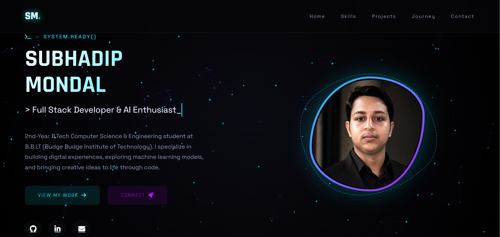

# 🚀 Subhadip Mondal Portfolio

Welcome to my personal portfolio website repository.  
This portfolio showcases my projects, skills, certifications, and journey as a Computer Science Engineering student.

---

## 🌐 Live Website

🔗 https://subhadip-mondal-portfolio.vercel.app/

---

## ✨ About The Portfolio

This portfolio website represents my:

- 💻 Technical Skills
- 🚀 Projects & Development Work
- 📜 Certifications
- 🎓 Academic Journey
- 🌟 Internship Experience

The website is designed with a modern UI, responsive layout, smooth animations, and interactive sections.

---

## 🛠️ Technologies Used

- HTML5
- CSS3
- JavaScript
- Font Awesome
- AOS Animation Library

---

## 📂 Portfolio Sections

- Home
- About
- Skills
- Projects
- Certifications
- Contact

---

## 📸 Preview



---

## 👨‍💻 Author

### Subhadip Mondal

- 🎓 B.Tech CSE Student
- 💡 Interested in Web Development, AI/ML & Cloud Computing

---

## 📬 Connect With Me

- GitHub: https://github.com/subhadipmondal99
- LinkedIn: https://www.linkedin.com/in/subhadip--mondal/

---

## ⭐ Thank You

Thank you for visiting my portfolio repository.
```
